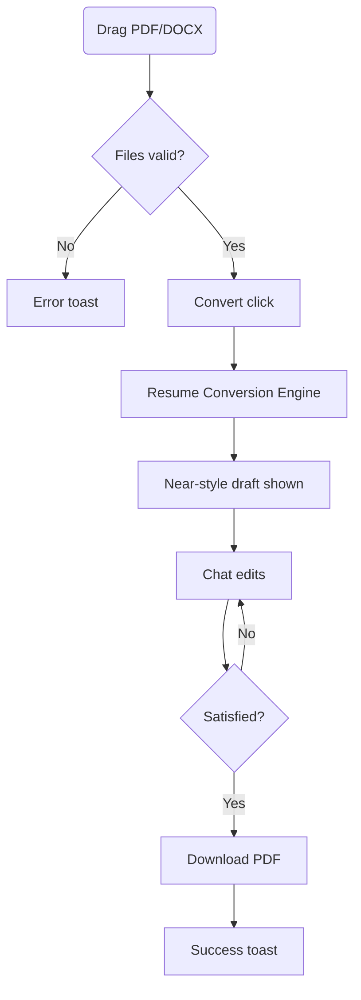
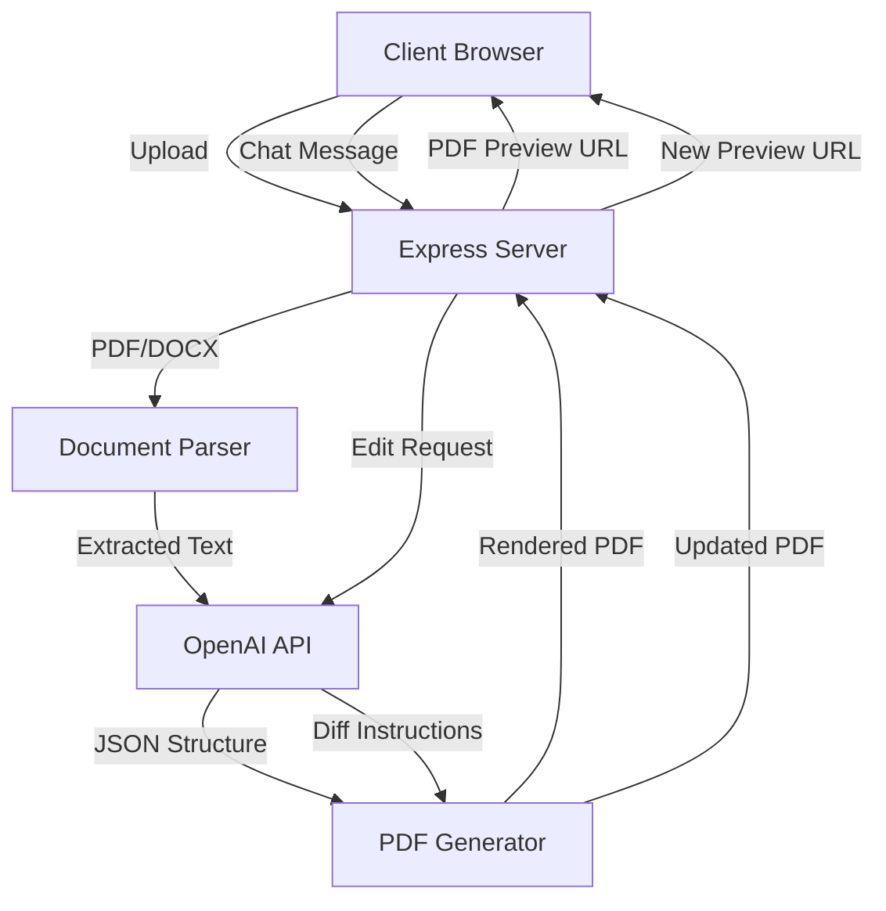

# Near Resume Processor - Implementation Guide for Replit

---

## 1 · Introduction & System Overview

This document provides detailed technical implementation guidelines for building the Near Resume Processor as a self-contained Replit web application. The system allows any Near team member to upload a resume PDF/DOCX, transform it into a standardized "Near-style" format, make adjustments via chat, and download the polished result for Airtable.

### Core Functionality

- **Upload**: Accept PDF/DOCX resumes up to 10MB
- **Process**: Transform to standardized one-page format
- **Chat**: Adjust content via natural language interface
- **Download**: Generate properly named, branded PDF

### Key Constraints

- **Single-App Architecture**: No external automations, webhooks, or third-party services
- **Processing Time**: ≤25 seconds for 95th percentile
- **Security**: No PII persistence beyond 24 hours
- **Deployment**: Runs entirely within one Replit project

---

## 2 · User Flows

### 2.1 Primary User Flow (Happy Path)



**Step-by-Step Process:**

1. User navigates to `https://near-resume.replit.co`
2. Drags resume file onto upload zone or uses file picker
3. Client validates file type (PDF/DOCX) and size (<10MB)
4. User clicks "Convert" button
5. Progress indicator shows processing status
6. System displays transformed resume in preview panel
7. User makes adjustments via chat interface
8. User downloads final PDF with proper naming
9. Success notification confirms completion

### 2.2 Edge Cases & Recovery Paths

**Oversized File:**
- System shows error toast: "File exceeds 10MB limit"
- Upload zone resets for new attempt
- User guide link offers compression tips

**Multi-Page Result:**
- System auto-applies hierarchical trimming logic
- Modal shows removed content with explanation
- User can restore via chat if needed

**Unreadable PDF (Scanned Image):**
- OCR attempt with confidence scoring
- If confidence <80%, error: "Text extraction failed"
- Suggestion to convert via external OCR tool first

**Long Processing Time:**
- Progress bar with percentage updates via SSE
- Timeout after 60 seconds with retry option
- Error logging for investigation

---

## 3 · Technical Architecture

### 3.1 Component Architecture



### 3.2 File Structure

```
/resume-processor
  /public
    /css
      styles.css
      normalize.css
    /js
      app.js
      upload.js
      chat.js
      preview.js
    /images
      near-logo.png
      favicon.ico
    index.html
  /src
    server.js           # Express entry point
    /routes
      convert.js        # POST /api/convert
      chat.js           # POST /api/chat
      download.js       # GET /api/download/:id
    /services
      parser.js         # PDF/DOCX extraction
      openai.js         # GPT interaction
      renderer.js       # PDF generation
      storage.js        # Temporary file management
    /utils
      currency.js       # Currency conversion
      sanitizer.js      # PII removal
      trimmer.js        # Page-fitting logic
    /templates
      resume.html       # Handlebars template
    /middleware
      error-handler.js
      file-validator.js
    /config
      constants.js
      openai-prompts.js
  /temp                 # Temporary storage (gitignored)
  .env
  package.json
  README.md
```

### 3.3 Key Dependencies

```json
{
  "dependencies": {
    "express": "^4.18.2",
    "multer": "^1.4.5-lts.1",
    "pdf-parse": "^1.1.1",
    "mammoth": "^1.6.0",
    "openai": "^4.20.0",
    "puppeteer": "^21.5.1",
    "handlebars": "^4.7.8",
    "uuid": "^9.0.1",
    "dotenv": "^16.3.1",
    "cors": "^2.8.5",
    "helmet": "^7.1.0",
    "patch-text": "^1.0.2",
    "pino": "^8.16.2",
    "tesseract.js": "^5.0.3"
  },
  "devDependencies": {
    "nodemon": "^3.0.1",
    "jest": "^29.7.0"
  }
}
```

### 3.4 Environment Variables

| Variable | Purpose | Example |
|----------|---------|---------|
| `OPENAI_API_KEY` | OpenAI API authentication | `sk-...` |
| `PORT` | Server port (default: 3000) | `3000` |
| `NODE_ENV` | Environment setting | `production` |
| `PDF_TEMP_DIR` | Temporary storage path | `./temp` |
| `PDF_EXPIRY_HOURS` | File retention period | `24` |
| `LOG_LEVEL` | Logging verbosity | `info` |

---

## 4 · API Endpoints

### 4.1 File Upload & Conversion

**Endpoint:** `POST /api/convert`

**Request:**
- `Content-Type: multipart/form-data`
- Body: `file` (PDF or DOCX)

**Response:**
```json
{
  "success": true,
  "data": {
    "sessionId": "f7c9a1b2-d3e4-5f6g-7h8i-9j0k1l2m3n4o",
    "pdfUrl": "/temp/f7c9a1b2.pdf",
    "originalFilename": "candidate_resume.pdf"
  }
}
```

**Error Response:**
```json
{
  "success": false,
  "error": {
    "code": "INVALID_FILE_TYPE",
    "message": "Only PDF and DOCX files are supported"
  }
}
```

**Implementation:**

```javascript
// /src/routes/convert.js
const express = require('express');
const multer = require('multer');
const router = express.Router();
const parserService = require('../services/parser');
const openaiService = require('../services/openai');
const rendererService = require('../services/renderer');
const storageService = require('../services/storage');
const { v4: uuidv4 } = require('uuid');

// Configure multer storage
const upload = multer({
  storage: multer.memoryStorage(),
  limits: { fileSize: 10 * 1024 * 1024 }, // 10MB
  fileFilter: (req, file, cb) => {
    const validTypes = ['application/pdf', 'application/vnd.openxmlformats-officedocument.wordprocessingml.document'];
    if (validTypes.includes(file.mimetype)) {
      cb(null, true);
    } else {
      cb(new Error('Invalid file type. Only PDF and DOCX are supported.'));
    }
  }
});

router.post('/convert', upload.single('file'), async (req, res, next) => {
  try {
    if (!req.file) {
      return res.status(400).json({
        success: false,
        error: { code: 'NO_FILE', message: 'No file uploaded' }
      });
    }

    // Generate session ID
    const sessionId = uuidv4();
    
    // Extract text from file
    const extractedText = await parserService.extractText(req.file.buffer, req.file.originalname);
    
    // Process with OpenAI
    const processedResume = await openaiService.transformResume(extractedText, sessionId);
    
    // Render to PDF
    const pdfPath = await rendererService.generatePDF(processedResume, sessionId);
    
    // Save session data
    await storageService.saveSession(sessionId, {
      originalFilename: req.file.originalname,
      processedResume,
      pdfPath
    });
    
    return res.json({
      success: true,
      data: {
        sessionId,
        pdfUrl: `/temp/${sessionId}.pdf`,
        originalFilename: req.file.originalname
      }
    });
  } catch (error) {
    next(error);
  }
});

module.exports = router;
```

### 4.2 Chat Interaction

**Endpoint:** `POST /api/chat`

**Request:**
```json
{
  "sessionId": "f7c9a1b2-d3e4-5f6g-7h8i-9j0k1l2m3n4o",
  "message": "Move the Toshiba bullet to #1"
}
```

**Response:**
```json
{
  "success": true,
  "data": {
    "pdfUrl": "/temp/f7c9a1b2-updated.pdf",
    "changes": [
      {
        "type": "move",
        "description": "Moved Toshiba bullet to top position"
      }
    ]
  }
}
```

**Implementation:**

```javascript
// /src/routes/chat.js
const express = require('express');
const router = express.Router();
const openaiService = require('../services/openai');
const rendererService = require('../services/renderer');
const storageService = require('../services/storage');

router.post('/chat', async (req, res, next) => {
  try {
    const { sessionId, message } = req.body;
    
    if (!sessionId || !message) {
      return res.status(400).json({
        success: false,
        error: { code: 'MISSING_PARAMS', message: 'Session ID and message are required' }
      });
    }
    
    // Retrieve session data
    const sessionData = await storageService.getSession(sessionId);
    if (!sessionData) {
      return res.status(404).json({
        success: false,
        error: { code: 'SESSION_NOT_FOUND', message: 'Session not found' }
      });
    }
    
    // Process chat message with OpenAI
    const { updatedResume, changes } = await openaiService.processChat(
      sessionId, 
      message, 
      sessionData.processedResume
    );
    
    // Generate updated PDF
    const updatedPdfPath = await rendererService.generatePDF(updatedResume, `${sessionId}-updated`);
    
    // Update session data
    await storageService.updateSession(sessionId, {
      ...sessionData,
      processedResume: updatedResume,
      updatedPdfPath
    });
    
    return res.json({
      success: true,
      data: {
        pdfUrl: `/temp/${sessionId}-updated.pdf`,
        changes
      }
    });
  } catch (error) {
    next(error);
  }
});

module.exports = router;
```

### 4.3 PDF Download

**Endpoint:** `GET /api/download/:sessionId`

**Response:**
- Content-Type: application/pdf
- Content-Disposition: attachment; filename="Senior SDR (Colombia) – C-4583.pdf"

**Implementation:**

```javascript
// /src/routes/download.js
const express = require('express');
const router = express.Router();
const path = require('path');
const fs = require('fs');
const storageService = require('../services/storage');

router.get('/download/:sessionId', async (req, res, next) => {
  try {
    const { sessionId } = req.params;
    
    // Retrieve session data
    const sessionData = await storageService.getSession(sessionId);
    if (!sessionData) {
      return res.status(404).json({
        success: false,
        error: { code: 'SESSION_NOT_FOUND', message: 'Session not found' }
      });
    }
    
    // Determine which PDF to send (updated or original)
    const pdfPath = sessionData.updatedPdfPath || sessionData.pdfPath;
    
    if (!fs.existsSync(pdfPath)) {
      return res.status(404).json({
        success: false,
        error: { code: 'FILE_NOT_FOUND', message: 'PDF file not found' }
      });
    }
    
    // Generate filename based on resume content
    const resumeData = sessionData.processedResume;
    const role = resumeData.header.tagline || 'Resume';
    const country = resumeData.header.country || 'International';
    const idSuffix = sessionId.substring(0, 4);
    
    const filename = `${role} (${country}) – C-${idSuffix}.pdf`;
    
    // Send file
    res.setHeader('Content-Disposition', `attachment; filename="${filename}"`);
    res.setHeader('Content-Type', 'application/pdf');
    
    const fileStream = fs.createReadStream(pdfPath);
    fileStream.pipe(res);
  } catch (error) {
    next(error);
  }
});

module.exports = router;
```

---

## 5 · Core Services Implementation

### 5.1 Document Parser Service

```javascript
// /src/services/parser.js
const pdfParse = require('pdf-parse');
const mammoth = require('mammoth');
const path = require('path');
const tesseract = require('tesseract.js');
const logger = require('../utils/logger');

class ParserService {
  async extractText(buffer, filename) {
    const fileExt = path.extname(filename).toLowerCase();
    
    try {
      if (fileExt === '.pdf') {
        return await this.extractFromPDF(buffer);
      } else if (fileExt === '.docx') {
        return await this.extractFromDOCX(buffer);
      } else {
        throw new Error(`Unsupported file format: ${fileExt}`);
      }
    } catch (error) {
      logger.error(`Text extraction failed: ${error.message}`);
      throw error;
    }
  }
  
  async extractFromPDF(buffer) {
    try {
      const data = await pdfParse(buffer);
      
      // If text content is too small, it might be a scanned PDF
      if (data.text.trim().length < 100) {
        logger.info('PDF appears to be scanned. Attempting OCR...');
        return await this.performOCR(buffer);
      }
      
      return data.text;
    } catch (error) {
      logger.error(`PDF parsing failed: ${error.message}`);
      throw error;
    }
  }
  
  async extractFromDOCX(buffer) {
    try {
      const result = await mammoth.extractRawText({ buffer });
      return result.value;
    } catch (error) {
      logger.error(`DOCX parsing failed: ${error.message}`);
      throw error;
    }
  }
  
  async performOCR(buffer) {
    try {
      const worker = await tesseract.createWorker();
      await worker.loadLanguage('eng');
      await worker.initialize('eng');
      
      const { data } = await worker.recognize(buffer);
      await worker.terminate();
      
      // Check confidence
      if (data.confidence < 80) {
        throw new Error('OCR confidence too low, text may be inaccurate');
      }
      
      return data.text;
    } catch (error) {
      logger.error(`OCR failed: ${error.message}`);
      throw error;
    }
  }
}

module.exports = new ParserService();
```

### 5.2 OpenAI Service

```javascript
// /src/services/openai.js
const { OpenAI } = require('openai');
const prompts = require('../config/openai-prompts');
const currencyUtils = require('../utils/currency');
const sanitizer = require('../utils/sanitizer');
const logger = require('../utils/logger');

class OpenAIService {
  constructor() {
    this.client = new OpenAI({
      apiKey: process.env.OPENAI_API_KEY
    });
    
    this.sessions = {};
  }
  
  async transformResume(resumeText, sessionId) {
    try {
      // Sanitize PII for safety
      const sanitizedText = sanitizer.redactSensitiveInfo(resumeText);
      
      // Create OpenAI thread for this session
      const thread = await this.client.beta.threads.create({
        metadata: { sessionId }
      });
      
      this.sessions[sessionId] = { threadId: thread.id };
      
      // Add message to thread
      await this.client.beta.threads.messages.create(thread.id, {
        role: 'user',
        content: `${prompts.RESUME_TRANSFORMATION_INSTRUCTION}\n\nRESUME TEXT:\n${sanitizedText}`
      });
      
      // Run the assistant
      const run = await this.client.beta.threads.runs.create(thread.id, {
        assistant_id: process.env.OPENAI_ASSISTANT_ID || prompts.DEFAULT_MODEL,
        instructions: prompts.RESUME_TRANSFORMATION_INSTRUCTION
      });
      
      // Wait for completion
      const completedRun = await this.waitForRunCompletion(thread.id, run.id);
      
      // Get assistant's response
      const messages = await this.client.beta.threads.messages.list(thread.id, {
        order: 'desc',
        limit: 1
      });
      
      const response = messages.data[0].content[0].text.value;
      
      // Parse JSON from response
      const jsonMatch = response.match(/```json\n([\s\S]*?)\n```/);
      if (!jsonMatch) {
        throw new Error('Failed to extract JSON from OpenAI response');
      }
      
      const resumeData = JSON.parse(jsonMatch[1]);
      
      // Process any currency conversions
      this.processCurrencyConversions(resumeData);
      
      return resumeData;
    } catch (error) {
      logger.error(`Resume transformation failed: ${error.message}`);
      throw error;
    }
  }
  
  async processChat(sessionId, message, currentResume) {
    try {
      if (!this.sessions[sessionId]) {
        throw new Error(`Session not found: ${sessionId}`);
      }
      
      const threadId = this.sessions[sessionId].threadId;
      
      // Add user message to thread
      await this.client.beta.threads.messages.create(threadId, {
        role: 'user',
        content: `${prompts.CHAT_INSTRUCTION}\n\nCURRENT RESUME:\n${JSON.stringify(currentResume, null, 2)}\n\nUSER REQUEST: ${message}`
      });
      
      // Run the assistant
      const run = await this.client.beta.threads.runs.create(threadId, {
        assistant_id: process.env.OPENAI_ASSISTANT_ID || prompts.DEFAULT_MODEL,
        instructions: prompts.CHAT_INSTRUCTION
      });
      
      // Wait for completion
      const completedRun = await this.waitForRunCompletion(threadId, run.id);
      
      // Get assistant's response
      const messages = await this.client.beta.threads.messages.list(threadId, {
        order: 'desc',
        limit: 1
      });
      
      const response = messages.data[0].content[0].text.value;
      
      // Parse JSON diff from response
      const jsonMatch = response.match(/```json\n([\s\S]*?)\n```/);
      if (!jsonMatch) {
        throw new Error('Failed to extract JSON from OpenAI response');
      }
      
      const changes = JSON.parse(jsonMatch[1]);
      
      // Apply changes to current resume
      const updatedResume = this.applyChanges(currentResume, changes);
      
      // Process any new currency conversions
      this.processCurrencyConversions(updatedResume);
      
      return {
        updatedResume,
        changes: changes.map(c => ({
          type: c.op,
          description: this.describeChange(c)
        }))
      };
    } catch (error) {
      logger.error(`Chat processing failed: ${error.message}`);
      throw error;
    }
  }
  
  async waitForRunCompletion(threadId, runId, maxAttempts = 60, delayMs = 1000) {
    let attempts = 0;
    
    while (attempts < maxAttempts) {
      const run = await this.client.beta.threads.runs.retrieve(threadId, runId);
      
      if (run.status === 'completed') {
        return run;
      } else if (['failed', 'cancelled', 'expired'].includes(run.status)) {
        throw new Error(`Run failed with status: ${run.status}`);
      }
      
      // Wait before next attempt
      await new Promise(resolve => setTimeout(resolve, delayMs));
      attempts++;
    }
    
    throw new Error('Run timed out');
  }
  
  processCurrencyConversions(resumeData) {
    // Process experience section for currency conversions
    if (resumeData.experience && Array.isArray(resumeData.experience)) {
      resumeData.experience.forEach(job => {
        if (job.bullets && Array.isArray(job.bullets)) {
          job.bullets = job.bullets.map(bullet => {
            return currencyUtils.convertCurrencies(bullet);
          });
        }
      });
    }
    
    // Process summary for currency mentions
    if (resumeData.summary) {
      resumeData.summary = currencyUtils.convertCurrencies(resumeData.summary);
    }
    
    return resumeData;
  }
  
  applyChanges(resume, changes) {
    const newResume = JSON.parse(JSON.stringify(resume));
    
    changes.forEach(change => {
      const { op, path, value, from, to } = change;
      
      if (op === 'replace') {
        // Navigate to the path and replace the value
        const pathParts = path.substring(1).split('/');
        let current = newResume;
        
        for (let i = 0; i < pathParts.length - 1; i++) {
          current = current[pathParts[i]];
        }
        
        current[pathParts[pathParts.length - 1]] = value;
      } else if (op === 'move') {
        // Extract the value from the source path
        const fromParts = from.substring(1).split('/');
        let fromCurrent = newResume;
        let fromValue;
        
        for (let i = 0; i < fromParts.length - 1; i++) {
          fromCurrent = fromCurrent[fromParts[i]];
        }
        
        fromValue = fromCurrent[fromParts[fromParts.length - 1]];
        
        // Remove it from the source
        delete fromCurrent[fromParts[fromParts.length - 1]];
        
        // Add it to the destination
        const toParts = to.substring(1).split('/');
        let toCurrent = newResume;
        
        for (let i = 0; i < toParts.length - 1; i++) {
          toCurrent = toCurrent[toParts[i]];
        }
        
        toCurrent[toParts[toParts.length - 1]] = fromValue;
      }
      // Add other operations as needed (add, remove, etc.)
    });
    
    return newResume;
  }
  
  describeChange(change) {
    switch (change.op) {
      case 'replace':
        return `Updated content at ${change.path}`;
      case 'move':
        return `Moved content from ${change.from} to ${change.to}`;
      case 'add':
        return `Added new content at ${change.path}`;
      case 'remove':
        return `Removed content at ${change.path}`;
      default:
        return `Applied ${change.op} operation`;
    }
  }
}

module.exports = new OpenAIService();
```

### 5.3 Renderer Service

```javascript
// /src/services/renderer.js
const puppeteer = require('puppeteer');
const handlebars = require('handlebars');
const fs = require('fs');
const path = require('path');
const util = require('util');
const readFile = util.promisify(fs.readFile);
const writeFile = util.promisify(fs.writeFile);
const mkdir = util.promisify(fs.mkdir);
const logger = require('../utils/logger');

class RendererService {
  constructor() {
    this.templatePath = path.join(__dirname, '../templates/resume.html');
    this.tempDir = process.env.PDF_TEMP_DIR || path.join(__dirname, '../../temp');
    
    // Create temp directory if it doesn't exist
    if (!fs.existsSync(this.tempDir)) {
      fs.mkdirSync(this.tempDir, { recursive: true });
    }
    
    // Register Handlebars helpers
    handlebars.registerHelper('formatDate', function(date) {
      if (!date) return '';
      return date;
    });
    
    handlebars.registerHelper('isCurrentRole', function(endDate) {
      return endDate === 'Present' || endDate.includes('Present');
    });
  }
  
  async generatePDF(resumeData, sessionId) {
    try {
      // Read the HTML template
      const templateSource = await readFile(this.templatePath, 'utf8');
      
      // Compile the template
      const template = handlebars.compile(templateSource);
      
      // Render the template with resume data
      const html = template(resumeData);
      
      // Save HTML for debugging (optional)
      const htmlPath = path.join(this.tempDir, `${sessionId}.html`);
      await writeFile(htmlPath, html);
      
      // Generate PDF using puppeteer
      const pdfPath = path.join(this.tempDir, `${sessionId}.pdf`);
      
      const browser = await puppeteer.launch({
        headless: 'new',
        args: ['--no-sandbox', '--disable-setuid-sandbox']
      });
      
      const page = await browser.newPage();
      await page.setContent(html, { waitUntil: 'networkidle0' });
      
      // Set margins to match requirements (0.7" = ~67px)
      await page.pdf({
        path: pdfPath,
        format: 'Letter',
        margin: {
          top: '0.7in',
          right: '0.7in',
          bottom: '0.7in',
          left: '0.7in'
        },
        printBackground: true
      });
      
      await browser.close();
      
      logger.info(`Generated PDF: ${pdfPath}`);
      return pdfPath;
    } catch (error) {
      logger.error(`PDF generation failed: ${error.message}`);
      throw error;
    }
  }
}

module.exports = new RendererService();
```

### 5.4 Storage Service

```javascript
// /src/services/storage.js
const fs = require('fs');
const path = require('path');
const util = require('util');
const readFile = util.promisify(fs.readFile);
const writeFile = util.promisify(fs.writeFile);
const unlink = util.promisify(fs.unlink);
const logger = require('../utils/logger');

class StorageService {
  constructor() {
    this.storagePath = process.env.PDF_TEMP_DIR || path.join(__dirname, '../../temp');
    this.sessions = {};
    this.expiryHours = parseInt(process.env.PDF_EXPIRY_HOURS || '24', 10);
    
    // Initialize cleanup job
    this.setupCleanupJob();
  }
  
  async saveSession(sessionId, data) {
    this.sessions[sessionId] = {
      ...data,
      createdAt: new Date()
    };
    
    // Save session data to file for persistence
    const sessionFilePath = path.join(this.storagePath, `${sessionId}.json`);
    await writeFile(sessionFilePath, JSON.stringify(this.sessions[sessionId]), 'utf8');
    
    logger.info(`Session saved: ${sessionId}`);
    return true;
  }
  
  async getSession(sessionId) {
    // If session is in memory, return it
    if (this.sessions[sessionId]) {
      return this.sessions[sessionId];
    }
    
    // Try to load from file
    try {
      const sessionFilePath = path.join(this.storagePath, `${sessionId}.json`);
      const data = await readFile(sessionFilePath, 'utf8');
      const session = JSON.parse(data);
      
      // Cache in memory
      this.sessions[sessionId] = session;
      
      return session;
    } catch (error) {
      logger.error(`Failed to load session ${sessionId}: ${error.message}`);
      return null;
    }
  }
  
  async updateSession(sessionId, data) {
    // Update in memory
    this.sessions[sessionId] = {
      ...data,
      updatedAt: new Date()
    };
    
    // Update file
    const sessionFilePath = path.join(this.storagePath, `${sessionId}.json`);
    await writeFile(sessionFilePath, JSON.stringify(this.sessions[sessionId]), 'utf8');
    
    logger.info(`Session updated: ${sessionId}`);
    return true;
  }
  
  async deleteSession(sessionId) {
    // Remove from memory
    delete this.sessions[sessionId];
    
    // Remove files
    try {
      const sessionFilePath = path.join(this.storagePath, `${sessionId}.json`);
      const pdfPath = path.join(this.storagePath, `${sessionId}.pdf`);
      const updatedPdfPath = path.join(this.storagePath, `${sessionId}-updated.pdf`);
      const htmlPath = path.join(this.storagePath, `${sessionId}.html`);
      
      const filesToDelete = [sessionFilePath, pdfPath, updatedPdfPath, htmlPath];
      
      for (const file of filesToDelete) {
        if (fs.existsSync(file)) {
          await unlink(file);
        }
      }
      
      logger.info(`Session deleted: ${sessionId}`);
      return true;
    } catch (error) {
      logger.error(`Failed to delete session ${sessionId}: ${error.message}`);
      return false;
    }
  }
  
  setupCleanupJob() {
    // Run cleanup every hour
    setInterval(() => {
      this.cleanupExpiredSessions();
    }, 60 * 60 * 1000);
    
    logger.info('Cleanup job scheduled');
  }
  
  async cleanupExpiredSessions() {
    const now = new Date();
    let count = 0;
    
    // Check all session files
    try {
      const files = fs.readdirSync(this.storagePath);
      
      for (const file of files) {
        if (!file.endsWith('.json')) continue;
        
        const sessionId = file.replace('.json', '');
        
        try {
          const sessionData = await this.getSession(sessionId);
          if (!sessionData) continue;
          
          const createdAt = new Date(sessionData.createdAt);
          const ageHours = (now - createdAt) / (1000 * 60 * 60);
          
          if (ageHours > this.expiryHours) {
            await this.deleteSession(sessionId);
            count++;
          }
        } catch (err) {
          logger.error(`Error processing file ${file}: ${err.message}`);
        }
      }
      
      logger.info(`Cleanup complete: removed ${count} expired sessions`);
    } catch (error) {
      logger.error(`Cleanup job failed: ${error.message}`);
    }
  }
}